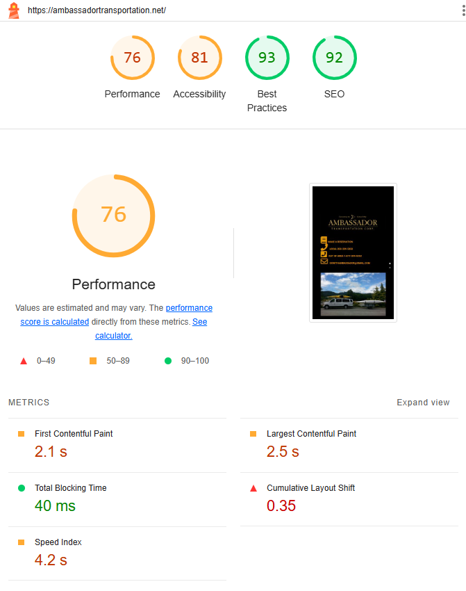
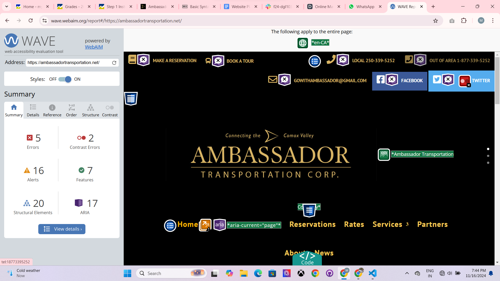
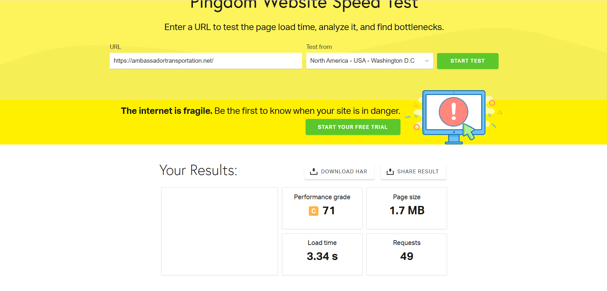
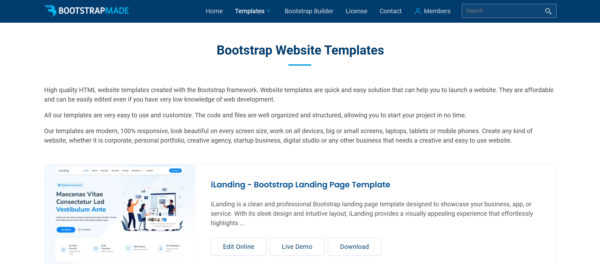

# 1.Project summary
- I chosen to redesign and build this website https://ambassadortransportation.net/

## Explain why the client needs a new website:

1. What is the most important purpose of this website?
- The most important purpose of this website is to booked the reservation of  transportation of the clients and giving the best facility to the customers.

2. Who is the target audience? Perhaps there are multiple target audiences? 
- The target audience is all the people who wants to plan going outside including youngsters and old age people.

3. What is the overall message you are trying to convey to your target audience on this website? What action do you want the audience to perform before they leave your website? Are there multiple ways they could take action? 
- The website seems to promote **Ambassador Transportation Corp.** as a reliable and convenient transportation service in the Comox Valley. It highlights the company's connection to the local area and its ability to provide transportation services. The primary action the website wants visitors to take is to make a reservation for their transportation needs. This can be done through the provided phone numbers or email address. 

- Multiple Ways to Take Action: 
    - Call the local or out-of-area phone number to make a reservation directly with a representative.
    - Send an email to the provided email address to inquire about availability and make a reservation.
    - Visit the company's physical location (if applicable) to make a reservation in person.
    -  A clear call-to-action (e.g., "Book Now," "Contact Us") to guide visitors towards the desired action.
    - Links to social media profiles to increase visibility and engagement.

4. Why is their current site not appropriate?
- This current site is not appropriate because of design is not good, content is missing as  well as there are some more reason of his site is not appropriate are:
  

There are  many reasons to do accessibility (https://wave.webaim.org/) 5 errors, 2 contrast errors and 16 alerts.

  

The speed in pingdom  (https://tools.pingdom.com/) is 71 performance grade.

  

# 2. Look and feel
### Describe how you will approach the design elements of the website. 
- **Mood:**  The site should convey clean and professional visual moods whem client open it.
- **Inspiration:**  

- **Colours:** The three colours choose in my redesign are rgb(9, 67, 168),rgb(43, 141, 190), rgba(211, 186, 27, 0.904), lightblue and black.
- **Images:** There are some logos and images take from original site and some another photos which is related from this site choose from google(https://unsplash.com).
- **Fonts:** The first font family for body  is  **"Times New Roman", Times, serif;** and second font family for headlines is **Arial, Helvetica, sans-serif;**.

#### To simulate what your web page might look like on a mobile device and desktop:
    1. With the webpage open in Chrome, right-click > Inspect.
    2. In the DevTools window, click on the Toggle Device button (in top left-hand corner).
    3. In the browser window, select Responsive from the Dimensions drop down menu. Type in the wireframe's mobile dimensions: 375px x 733px. Make sure that zoom level is set to 100% in the browser.
    4. The desktop layout is 1200px.

# WEBSITE CONTENT

**INDEX**

HEADER
- LOGO
- NAVIGATION
    - HOME
    - RESERVATION
    - ABOUT
    - FACILITY
    - CONTACT

HERO SECTION
- HEADING
- IMAGES

ABOUT SECTION
- HEADING 
- IMAGE
- PARAGRAPH

BENEFITS SECTION 
- HEADING
- LIST OF 3 REASONS WHY OUR COMPANY IS BEST:
- LINK TO 'WHY WORK WITH US' Page:

CALL-TO-ACTION SECTION
- HEADING
- LINK
 
FOOTER SECTION 
- IMAGE
- PARAGRAPH
- MAP
- NAVIGATION
- COPYRIGHT NOTICE:

**ABOUT US PAGE**

HEADER
- same as index

HERO SECTION
- same as index

HISTORY SECTION
- HEADING
- YOUTUBE LINK
- PARAGRAPH
- IMAGES

CONTACT SECTION
- HEADING
- PARAGRAPHS

FOOTER SECTION
- same as index

**FACILITY PAGE**

HEADER
- same as index

FACILITY SECTION
- IMAGES
- HEADING
- PARAGRAPHS

CALL-TO-ACTION
- same as index

FOOTER
- same as index